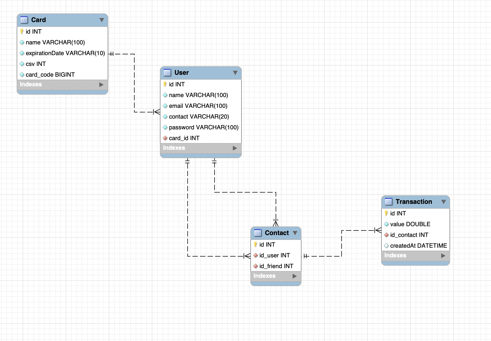

<h1> Projecto de programação php - IEFPWay</h1>

 Este projeto consiste numa aplicação para enviar dinheiro facilmente entre utilizadores.
É usado uma base de dados MySQL para registar todas as operações efectuadas entre os utilizadores.
  Na aplicação é possivel:  
<ul>
<li> Registar um novo utilizador.</li> 
<li> Iniciar sessão </li> 
<li> Adicionar um novo amigo (Já registado na app)</li>
<li> Enviar dinheiro para um amigo </li> 
<li> Carregar o saldo da conta </li>
</ul>

 A base de dados têm o seguinte diagrama: 

 Cada grupo deve implementar:

<h3>Lista de tarefas</h3>
<ol>
<li> Criar um repositório Git que inclua os membros do grupo e o formador com o projeto
</li>
<li> Criar o SQL com os comandos que gerem a base de dados segundo o diagrama relacional.
 Juntar o SQL ao código.
</li>
<li> Ler os comentários do ficheiro register.php e completar de acordo com o que for pedido.
</li>
<li> Ler os comentários do ficheiro login.php e completar de acordo com o que for pedido.
</li>
<li> Ler os comentários do ficheiro topup.php e completar de acordo com o que for pedido.
</li>
<li> Ler os comentários do ficheiro addfriend.php e completar de acordo com o que for pedido.
</li>
<li> Ler os comentários do ficheiro sendmoney.php e completar de acordo com o que for pedido.
</li>

</ol>